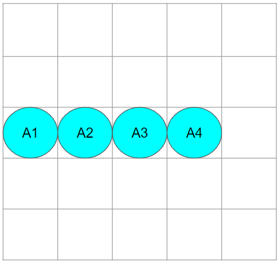

# Array vs LinkedList
## 1. Array
배열은 메모리상에 같은 타입의 데이터를 연속된 공간에 나열하고, 각 데이터에 인덱스를 부여해 놓은 자료 구조를 의미한다.

예를 들어 A1 ~ A4까지의 데이터를 배열로 만들면 아래 그림과 같이 생성된다.

컴퓨터는 메모리에 저장된 위의 배열의 위치를 알고있기 때문에 내가 A3를 조회를하면, A1 $\rightarrow$ A2 $\rightarrow$ A3 이렇게 찾아가지 않고 3번째 인덱스를 조회하여 바로 데이터 확인이 가능하다. 그래서 배열에서 조회를 할 때의 시간 복잡도는 O(1)과 같다.

배열의 경우 최초 생성했을 때의 고정된 크기의 데이터로 생성되기 때문에 한번 생성된 배열의 삽입과 삭제가 불가능하다. 그래서 삽입과 삭제를 하기 위해서는 arrayList를 생성하거나, 새로운 배열을 만들어서 할당해서 마치 배열에 값이 추가된 것 처럼 소스코드로 구현해야 한다.

이러한 면에서 배열은 데이터의 삽입과 삭제가 빈번할 때 사용은 적합하지 않다.

## 2. LinkedList
연결리스트란 각 노드가 데이터와 포인터를 가지고 메모리 상에 분산되어 존재하며 존재하게 된다. 각 노드에 포함된 포인터는 다음 노드를 연결하게 된다.

연결리스트는 **단일 연결 리스트**, **이중 연결 리스트**, **원형 연결 리스트** 이렇게 3가지 종류로 구분 할 수 있다.

#### 1. 단일 연결 리스트  
단일 연결 리스트는 각 노드에 데이터가 저장되어있는 자료 공간과 포인터 공간이 존재하고, 각 포인터는 다음 노드를 가리키는 구조이다.

*이미지 출처 : https://ko.wikipedia.org/wiki/%EC%97%B0%EA%B2%B0_%EB%A6%AC%EC%8A%A4%ED%8A%B8*

#### 2. 이중 연결 리스트
인중 연결 리스트는 단일 연결 리스트와 마찬가지로 자료 공간과 포인터 공간이 존재하지만 포인터 공간이 총 2개가 존재하며, 각 포인터 공간은 이전 노드, 다음 노드를 가리킨다.

*이미지 출처 : https://ko.wikipedia.org/wiki/%EC%97%B0%EA%B2%B0_%EB%A6%AC%EC%8A%A4%ED%8A%B8*

#### 3. 원형 연결 리스트
원형 연결 리스트는 단일 연결 리스트에서 제일 마지막 노드가 처음 노드를 연결시켜 원형으로 이루어진 구조이다.

*이미지 출처 : https://ko.wikipedia.org/wiki/%EC%97%B0%EA%B2%B0_%EB%A6%AC%EC%8A%A4%ED%8A%B8*
 

연결리스트는 메모리상에 빈 공간에 데이터를 생성 한뒤 노드로 연결만 하면 되기 때문에 최초 생성 시 크기가 고정되지 않는다. 그래서 데이터의 삭제와 삽입이 배열보다는 효율적이다.

하지만 데이터 조회를 할 때 데이터들이 메모리상에 모두 떨어져 있기 때문에 최초 노드를 찾고.. 그 다음.. 그 다음 노드를 찾아가기 때문에 시간 복잡도는 O(n)의 형태를 띄게 된다.

하지만 삽입/삭제를 할 때에는 주변 노드들의 link만 수정하면 되기 때문에 특정 값에 비례하지 않고 항상 일정하다. 시간 복잡도는 O(1)의 형태이다.

 
 
 

## _References_
- https://inpa.tistory.com/entry/JCF-%F0%9F%A7%B1-ArrayList-vs-LinkedList-%ED%8A%B9%EC%A7%95-%EC%84%B1%EB%8A%A5-%EB%B9%84%EA%B5%90
- https://ko.wikipedia.org/wiki/%EC%97%B0%EA%B2%B0_%EB%A6%AC%EC%8A%A4%ED%8A%B8