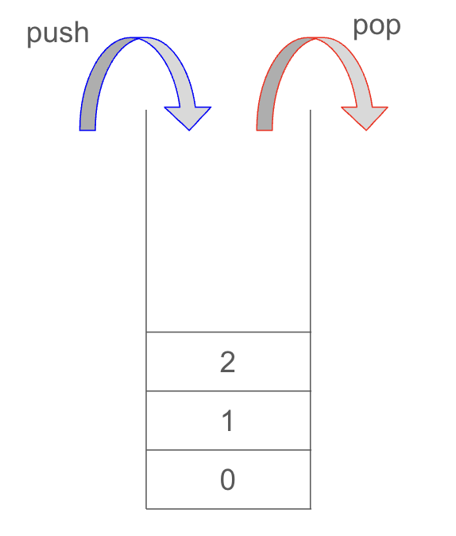
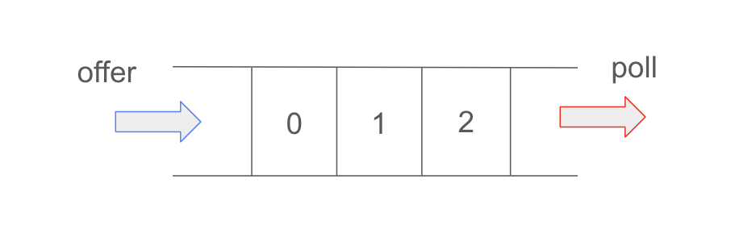

# Stack and Queue
## 📌 Stack
스택(Stack)이란 "쌓다" 라는 의미를 가지며, 책을 쌓듯 데이터를 순서대로 쌓아 올리는 형태의 자료구조를 말한다. 데이터는 가장 마지막에 삽입된 데이터가 가장 먼저 삭제되는 형태의 구조이다. 예를들어 인터넷 브라우저에 뒤로가기 버튼이나, 되돌리기(Control + Z)를 했을 때 가장 최근의 데이터가 먼저 보여지게 되는데 이를 이해하면 쉽다.

또한 스택은 정해진 방향(top)으로만 쌓을 수 있다. top으로 정한 곳을 통해서만 데이터의 삽입이 가능하고, 데이터의 삭제가 가능하다.

스택에서는 삽입을 push, 삭제를 pop이라고 하며, 이러한 스택의 구조를 후입선출(Last In First Out)이라고 한다.

그리고 비어있는 스택에서 데이터를 얻으려고 할 때를 stack underFlow라고 하며, 반대로 스택이 넘치는 경우를 stack overFlow라고 부른다.

## 📌 Queue
Queue는 Stack과 반대로 선입선출(First In First Out)의 구조를 가지고 있다. 삭제 연산이 이루어지는 곳을 프론트(front), 삽입 연산이 이루어지는 곳을 리어(rear)라고 하며, 선입선출의 구조이다 보니 삽입과 삭제가 스택처럼 한 곳에서 이루어지지 않고 한쪽에서는 삭제, 반대쪽에는 삽입이 이루어지는 형태의 자료구조이다.

Queue의 rear에서 이루어지는 삽입 연산을 인큐(enqueue)라고 하며, front에서 이루어지는 삭제 연산을 디큐(dequeue)라고 부른다.

## 📌 Stack Method
|Method|Return Type|Description|Exception|
|------|---|---|---|
|empty()|boolean|Stack이 비어있는지 여부 확인|X|
|peek()|Object|Stack의 맨 위의 객체를 반환(객체를 Stack에서 꺼내지 않음)|Stack이 비어있을 경우 EmptyStackException|
|pop()|Object|Stack의 맨 위의 객체를 꺼내서 반환|Stack이 비어있을 경우 EmptyStackException|
|push(Object i)|Object|Stack에 객체 i를 저장|X|
|search(Object i)|int|Stack에서 객체를 찾아서 그 위치를 반환(못 찾으면 -1를 반환, 위치는 0이 아니라 1부터 시작)|X|

## 📌 Queue Method
|Method|Return Type|Description|Exception|
|---|---|---|---|
|add(Object i)|boolean|객체를 Queue에 저장(성공하면 true)|용량 초과 시 IllegalStateException 예외 발생|
|offer(Object i)|boolean|객체를 Queue에 저장(성공하면 true 실패시 false)|용량을 초과해서 실패하더라도 예외를 발생시키지 않음
|remove()|Object|Queue에서 제일 앞 객체를 꺼내서 반환|Queue가 비어있으면 NoSuchElementException 발생|
|element()|Object|Queue에서 제일 앞 객체를 삭제 없이 반환|Queue가 비어있으면 NoSuchElementException 발생|
|poll()|Object|Queue에서 제일 앞 객체를 꺼내서 반환|Queue가 비어있으면 null 반환|
|peek()|Object|Queue에서 제일 앞 객체를 삭제 없이 반환|Queue가 비어있으면 null반환|

 
 
 

## _References_
- https://devuna.tistory.com/22
- https://pridiot.tistory.com/68
- https://jud00.tistory.com/entry/%EC%9E%90%EB%A3%8C%EA%B5%AC%EC%A1%B0-%EC%8A%A4%ED%83%9DStack%EA%B3%BC-%ED%81%90Queue%EC%97%90-%EB%8C%80%ED%95%B4%EC%84%9C-%EC%95%8C%EC%95%84%EB%B3%B4%EC%9E%90