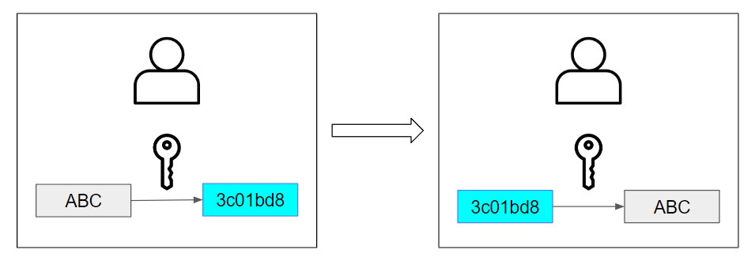

# 대칭키와 공개키(비대칭키)
## 학습목표
1. 대칭키란?
2. 공개키(비대칭키)란?
3. 대칭키와 공개키의 차이

 

## 1. 대칭키란?
대칭키란 암호화 방식 중 암호화 할때와 복호화 할때 사용하는 키가 같은 경우를 말한다. 어떠한 정보가 대칭키 방식으로 암호화가 되었다고 해당 암호화된 데이터를 확인할 수 있는 사람은 똑같은 키를 가지고 있는 사람 말고는 없다는 의미이다. 송신자와 수신자가 암/복호화를 위한 키를 안전하게 교환하는 것이 대칭키 방식의 중요한 부분이라고 말할 수 있다. 클라이언트와 서버와 TLS통신에서는 이런 대칭키 교환을 위해 공개키 방식을 사용하고 있다.

   

 
 

## 2. 공개키(비대칭키)란?

 
 
 

## _References_
- https://universitytomorrow.com/22
