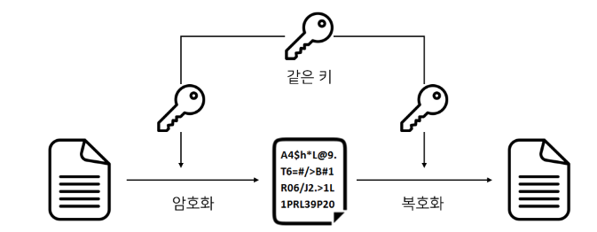
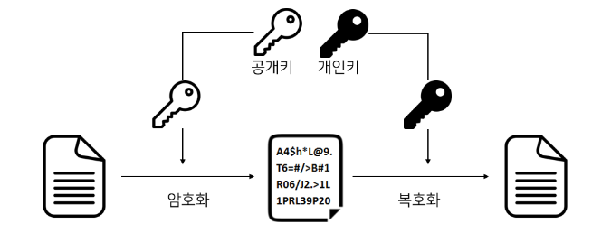

# 대칭키와 공개키(비대칭키)
## 학습목표
1. 대칭키란?
2. 공개키(비대칭키)란?
3. 대칭키와 공개키의 차이

 

## 1. 대칭키란?
대칭키란 암호화 방식 중 암호화 할때와 복호화 할때 사용하는 키가 같은 경우를 말한다. 어떠한 정보가 대칭키 방식으로 암호화가 되었다고 해당 암호화된 데이터를 확인할 수 있는 사람은 똑같은 키를 가지고 있는 사람 말고는 없다는 의미이다. 송신자와 수신자가 암/복호화를 위한 키를 안전하게 교환하는 것이 대칭키 방식의 중요한 부분이라고 말할 수 있다. 클라이언트와 서버와 TLS통신에서는 이런 대칭키 교환을 위해 공개키 방식을 사용하고 있다.

 
 

## 2. 공개키(비대칭키)란?
공개키 방식이란 대칭키와는 달리 데이터의 암/복호화에 사용되는 키가 다른 방식이다. 공개키 방식은 공개키-개인키의 한쌍으로 이루어져 있는데, 예를들어 클라이언트는 공개되어 있는 서버의 공개키로 데이터를 암호화해서 서버로 전달하면 서버는 자기 자신만 알고있는 대칭키로 해당 데이터를 복호화해서 데이터를 확인 할 수 있다.

그리고 반대로 서버는 자신의 개인키로 암호화한 데이터를 전달하면 클라이언트는 공개키로 해당 데이터를 복호화 후 확인이 가능하다.

이렇게 되면 발생하는 문제가 공개키는 누구에게나 공개되어있기 때문에 중간에 데이터를 탈취하더라도 누구나 확인이 가능하다. 이러한 방법은 보안에 취약하긴 하지만 데이터가 무엇인가가 초점이 아닌 이 데이터가 어떤 서버에서 전달되었는지가 초점이 맞춰진 방식인 것이다.
이러한 기술은 주로 데이터의 신원이 보장되는 '전자서명'등의 공인인증체계의 기본이 된다.

 
 

## 3. 대칭키와 공개키의 차이
 ||대칭키|공개키|
|------|---|---|
|키 관계|암호화 키 = 복호화 키|암호화 키 != 복호화 키|
|암호화 속도|빠름|느림|
|부인방지|불가능|가능|
|키 길이|주로 64비트, 128비트 등 작은 길이|주로 512비트, 1025비트 등 큰 길이|
|키 보관|비밀리에 보관|개인키는 비밀리에 보관, 공개키는 어디든지 배포|
|알고리즘|AES, SEED, ARIA..|DAS, RAS, ECC...

 
 
 

## _References_
- https://universitytomorrow.com/22
- https://creampuffy.tistory.com/199
- https://gunjoon.tistory.com/149