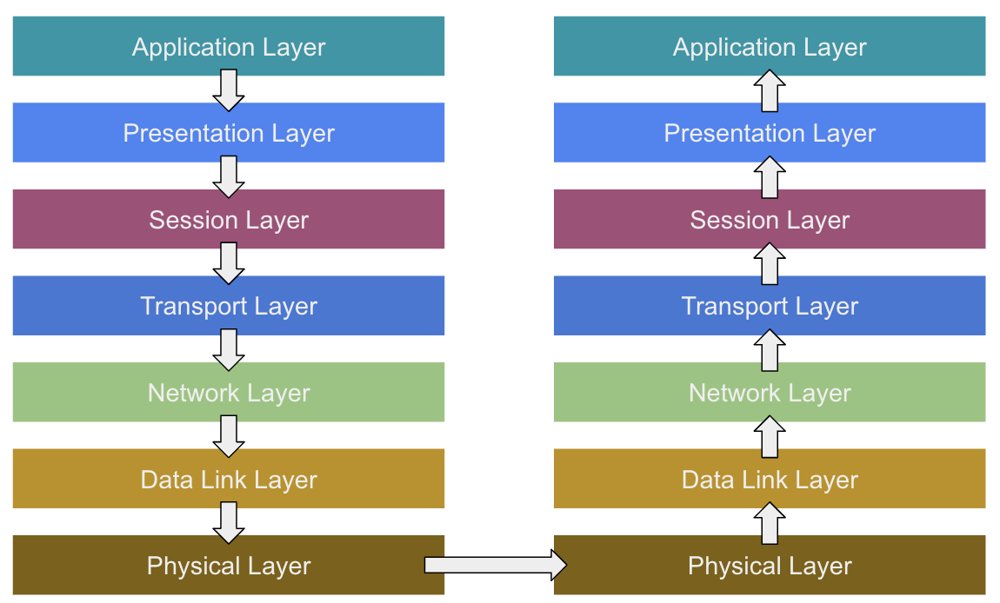

# OSI 7계층

> 정의 : **통신이 일어나는 과정**을 7단계로 정의한 국제통신표준 규약이다.

 

## 1. Application Layer (응용계층)
사용자가 직접 경험하고 있는 가장 가까운 계층이다. 
응용 프로세스와 직접 관련되어 사용자들에게 서비스를 제공한다. 
대표적인 프로토콜으로는 HTTP/HTTPS, FTP, Telnet 등이 있다.  

 

## 2. Presentation Layer
세션계층 간의 주고받은 인터페이스를 일관성 있게 제공한다. 
전달받은 데이터를 암호화, 압축 등 의 역활을 수행하게 된다.

 

## 3. Session Layer
통신장치 간의 상호작용을 설정하고 유지하며 동기화를 하게 된다. 
데이터가 통신하기 위한 논리적인 연결을 담당하게 되며, TCP/IP세션을 만들고 없애는 책임을 지게 된다. 
대표적인 프로토콜으로는 SSH, TLS, Socket 등이 있다.

 

## 4. Transport Layer
두 호스트 시스템으로부터 발생하는 데이터의 흐름을 제공하게 된다. 
데이터의 전송을 위해서 포트를 사용하며, 발신지와 목적지간의 제어와 에러를 관리하게 된다. 
패킷의 전송이 유효한지 확인하고 전송의 실패된 패킷을 다시 보내는 것과 같은 신뢰성 있는 통신을 보장하게 된다.

 

## 5. Network Layer
IP주소를 제공하는 계층이며, 데이터를 목적지까지 가장 안전하고 빠르게 전달하는 기능을 한다. 
**라우터**를 통해 최적의 경로를 선택하여 IP 주소를 지정하고, 해당 경로에 따라 데이터 전달
전송되는 데이터는 패킷단위로 분할하여 전송한 후 다시 합쳐진다.
 
 
>  Q: **라우터**란? 
>  A: 라우터는 둘 이상의 패킷 전환 네트워크 또는 서브네트워크를 연결하는 장치이다. 라우터는 데이터 패킷을 의도한 IP 주소로 전달하여 이러한 네트워크 간의 트래픽을 관리하고, 여러 장치가 동일한 인터넷 연결을 사용할 수 있도록 하는 등, 두 가지 주요 기능을 제공하게 된다.
>
> 예를들어) 비행기는 정확하게 정해진 목적지가 있고 항공관제사는 해당 비행기가 목적지까지 도착할 수 있도록 보장하는 역활을 한다. 여기서 비행기는 패킷이고, 항공관제사는 라우터의 역활을 하는 것 이다.

 

## 6. Data Link Layer (데이터링크 계층)
데이터 링크 계층에서는 물리계층으로 송/수신되는 정보를 확인하고 오류없는 통신을 하기위한 역활을 수행하게 된다. 그래서 해당 계층에서는 통신의 오류를 잡고 재전송도 하는 기능을 수행한다.  
해당 계층에서는 **MAC주소**를 통해 통신하게 된다.
 
 
>  Q: **MAC주소**란? 
>  A: MAC주소란 쉽게 비교하자면, 하드웨어 장비들의 주민등록번호이다. -(하이픈)으로 표기했을 때 00-60-97-8F-4F-86 이런 형태를 나타내고 있다. 참고로 Data Link Layer에서는 Mac 주소를 통해 통신을 하고 Network Layer로 넘어가서 IP를 이용해서 통신을 하게 된다.

 

## 7. Physical Layer (물리계층)
데이터를 기계적인 신호로 변환해서 주고받는 기능을 진행하는 공간이다. 
해당 계층에서는 데이터가 무엇인지 에러가 발생했는지 등 전혀 고려를 하지 않고 오직 데이터 전송하거나 받기만 진행한다. 
ex) 통신케이블, 허브 등...

 
 
 

---
## _References_
- https://jungeun960.tistory.com/181
- https://inpa.tistory.com/entry/WEB-%F0%9F%8C%90-OSI-7%EA%B3%84%EC%B8%B5-%EC%A0%95%EB%A6%AC
- https://github.com/hongcheol/CS-study/tree/main/Network#osi-7%EA%B3%84%EC%B8%B5
-  https://www.cloudflare.com/ko-kr/learning/network-layer/what-is-a-router/
