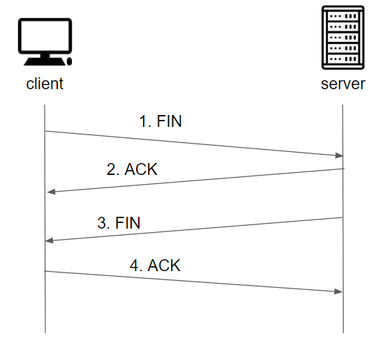

# TCP/UDP
## 학습목표
1. TCP의 특징
2. UDP의 특징
3. TCP / UDP의 차이
4. TCP를 주로 사용하는 이유

 

## 1. TCP의 특징
TCP(Transmission Control Protocol)는 **연결 지향적 프로토콜**이며, 장치들 사이에 논리적인 접속을 성립하기 위해 연결을 설정해 신뢰성을 보장하는 연결형 프로토콜이다. 
> Q: 연결 지향적 프로토콜이란?  
> A: 연결 지향적 프로토콜이란 클라이언트와 서버가 서로 연결된 상태에서 데이터를 주고받는 프로토콜을 의미한다.

### 3-way handshake방식 (연결)

1. client가 server로 연결요청(SYN)을 보낸다 > **SYN 패킷 전송**
2. server는 요청을 정상적으로 받고 그에 대한 응답(ACK)을 client에게 다시 보내준다 > **SYN + ACK 패킷 전송**
3. client는 SYN + ACK를 받고 서버에 잘 받았다고 다시 응답(ACK)을 보내준다. > **ACK 패킷 전송**

### 4-way handshake방식 (연결 해제)

1. 먼저 close를 실행한 client가 FIN패킷을 보낸다 > **FIN 패킷 전송**
2. server는 요청을 받고 그에 대한 응답(ACK)을 client에게 다시 보내준다 > **ACK 패킷 전송**
3. server는 종료 프로세스를 진행하고 FIN을 클라이언트로 다시 보낸다 > **FIN 패킷 전송**
4. FIN을 받은 client는 그에 대한 응답(ACK)을 sever로 보낸다 > **ACK 패킷 전송**

 

이러한 TCP의 특징으로는
1. **연결지향적**
2. **흐름 제어**
    - 데이터 처리 속도를 조절하여 수신자의 버퍼 오버 플로우를 방지한다.
3. **높은 신뢰성을 보장**
    - 서로 상호작용 하며 통신을 하기때문에 UDP보다는 높은 신뢰성을 보장한다.
4. **멀티캐스트 불가능**
    - 단일 송신자와 단일 수신자 간에 단일 경로 연결이 설정된다.

 
 

## 2. UDP의 특징

## 3. TCP / UDP의 차이

## 4. TCP를 주로 사용하는 이유

 
 
 

## _References_
- https://dev-coco.tistory.com/144
- http://www.ktword.co.kr/test/view/view.php?m_temp1=347
