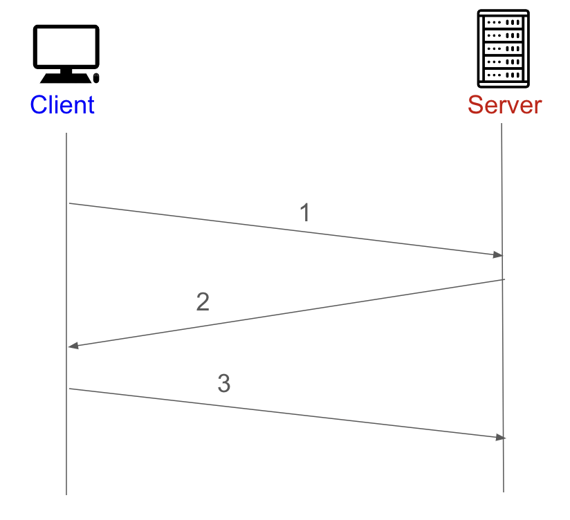

# TLS/SSL handshake
## 학습목표
1. SSL이란?
2. TLS란?
3. TLS/SSL handshake

 

## 1. SSL이란?
원래 웹에서는 데이터를 누구나 읽을 수 있는 텍스트의 형태로 전송되었다. 그 덕분에 중간에 데이터를 가로채면 누구나 읽을 수 있고 변조도 가능하게되고 이러한 문제 때문에 데이터의 무결성을 보장하기 위해 Netscape가 처음 SSL을 개발하게 되었다.

**SSL(Secure Socket Layer)** 이란 암호화 기반 인터넷 보안 프로토콜이다. 전달되는 모든 데이터는 암호화되며, 특정 유형의 사이버 공격도 차단한다.

우리가 사용하는 HTTP 프로토콜에 SSL인증서를 적용하게 되면 HTTPS 프로토콜을 사용하게 되는데, HTTPS는 보안에 더 강한 프로토콜이라고 할 수 있다.

      
*이미지 출처 : https://www.cloudflare.com/ko-kr/learning/ssl/what-is-ssl/*

하지만 SSL은 1996년 SSL 3.0이후 업데이트 되지 않으며, 여러가지 취약점이 알려져 있어서 사용 중단을 권고 하고있다. 그 대안으로 나온 것이 TLS이다.

 
 

## 2. TLS란?
TLS란 SSL의 업데이트 버전이며 TLS의 최초 버전인 TLS 1.0과 SSL 3.0은 크게 차이가 없다. SSL에서 TLS로 이름이 변경된 것은 SSL을 개발한 Netscape가 업데이트에 참여하지 않아서 소유권 변경을 위해서라고 한다. 현재는 업그레이드 버전인 TLS 1.2, TLS 1.3을 많이 사용하고 있다

결과적으로 SSL과 TLS는 이름만 다른 뿐이지 거의 같은 개념이라고 볼 수 있다.

 
 

## 3. TLS/SSL handshake
TLS가 적용된 상태에서 Client와 Server는 아래 이미지와 같이 최초 통신으로 handshake를 맺게 된다. 
 

### 1. Client &rarr; Server

클라이언트가 서버에 접속하게 된다. 이 단계를 client hello라고 부른다. 클라이언트는 서버에 접속하면서 몇가지 정보를 전달하게 되는데,
- **Client가 생성한 랜덤데이터**
- **Client가 지원하는 암호화 방식들**
    - Client와 Server가 지원하는 암호화 방식이 서로 다를 수 있다. 어떤 암호화 방식을 사용할지 서로 정해야하는데, 이를 위해서 Client가 자신이 사용 가능한 암호화 방식을 Server로 전송하게 된다.
- **새션ID**
    - 이미 핸드쉐이킹을 했다면 비용과 시간을 절약하기 위해 기존의 세션을 재활용하게 된다.

### 2. Server &rarr; Client

Server는 Client에 대한 응답을 하는데, 이를 server hello라고 부른다. 이 때 Server는 Client에게 몇가지 정보를 전달한다.
- **Server가 생성한 랜덤데이터**
- **Server가 선택한 암호화 방식**
- **인증서**

### 3. Client &rarr; Server

Client는 Server가 보낸 인증서가 CA에 의해서 발급된 것인지 확인하기 위해서 Client에 내장된 CA리스트를 확인하게 된다. 만약 리스트에 없다면 사용자에게 경고 메시지를 출력한다. 인증서 확인 후 Client에 내장된 CA공개키로 인증서를 복호화하게 되고, 복호화까지 성공하면 Client는 이제 Server를 믿을 수 있게 되는 것이다.

Client는 1번과 2번에서 획득한 Client의 랜덤 데이터 + Server의 랜덤 데이터를 조합하여, 대칭키를 생성하게 되고, 이 대칭키를 인증서 안에 있던 Server의 공개키로 암호화를 해서 Server로 전달하게 된다.

### 4. Server

Server는 Client가 전달한 암호화된 대칭키를 자신의 비밀키롤 복호화를 진행하게 된다. 이렇게 되면 Client와 Server모두 대칭키를 가지게 되고, 이제 서로 송/수신되는 암호화되는 데이터는 이 대칭키로 복호화해서 확인이 가능하다.

 
 
 

## _References_
- https://kanoos-stu.tistory.com/46
- https://www.cloudflare.com/ko-kr/learning/ssl/what-is-ssl/
